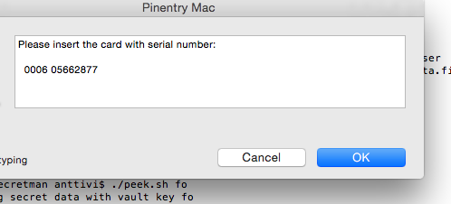
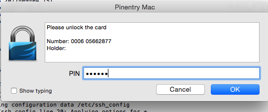

# secretman

Tools for managing secrets with Yubikey. This is a work-in-progress at the moment, but may become something like a tutorial or Proof-of-Concept. We'll see.

This is not a review of the product, just my notes about using it for practical purposes. I have identified several use-cases and tried to cover these case by case.

## What is Yubikey

[Yubikey](https://www.yubico.com/products/yubikey-hardware/) is a commercial product which can be used to some interesting and useful things, such as: 
encrypting files, signing data digitally and as a two-factor authentication mechanism. Effectively Yubikey is a hardware implementation which controls
access to the secret keys necessary for those feats and these secret keys can't be extracted. (At least, there are no known exploits or practical ways
to extract the keys or make a copy of the key).

Yubikey is not unique, there are other similar products emerging, such as [OnlyKey](https://www.amazon.com/OnlyKey-Color-Password-Manager-Obsolete/dp/B06Y1CSRZX), which
is essentially similar to Yubikey.

Overview of the topics and possibilities:


## Use-case 1: two-factor authentication, using FIDO U2F

The most common two-factor authentication is perhaps [Google Authenticator](https://en.wikipedia.org/wiki/Google_Authenticator) used with a phone. SMS being perhaps the second most popular. RSA dongles work, but they
cost money and can't be used for anything else so they are out for most normal use cases.

FIDO U2F is a new standard and super simple way for user to authenticate actions for a web application. This [FIDO U2F tutorial](https://fidoalliance.org/assets/downloads/FIDO-U2F-UAF-Tutorial-v1.pdf) explains how it works internally. The important thing is that a web browser (and web application) is allowed to talk with FIDO U2F compliant USB device without resorting to complicated things like WebUSB. 

Compared to phone, this is better from the security point of view.

Yubikey supports other authentication mechanisms and can be used to emulate Google Authenticator, but FIDO U2F is usable for normal people without technical knowledge.


## Technical preparations and precautions

Being a programmer I want the solution to support command line access and automation as much as possible. Also, one must plan for the possibility that Yubikey is lost or destroyed for some reason. There must be a way to recover and one should test the recovery plan in advance to make sure it actually works.

There are multiple tutorials about these things, here are some I used as a reference:
* (https://github.com/drduh/YubiKey-Guide)
* (https://florin.myip.org/blog/easy-multifactor-authentication-ssh-using-yubikey-neo-tokens)
* (https://blog.liw.fi/posts/2017/05/29/using_a_yubikey_4_for_ensafening_one_s_encryption/)

Here's a short summary. I use a Mac, so all steps are not appropriate for Linux or Windows, ability to reason required.

### Install necessary software

* Install GPG (OpenPGP). Make sure it's v2 to support 4096 bit keys.
* Install pinentry program (with Mac at least)

(Assumed that you are using Homebrew, but you almost certainly are if you are a developer working with a Mac)

See (https://github.com/Homebrew/homebrew-core/issues/14737)
```
brew install pinentry-mac
echo "pinentry-program /usr/local/bin/pinentry-mac" >> ~/.gnupg/gpg-agent.conf
```

Pinentry program is used by gpg to ask for your PIN code (in case of Yubikey) or a passphrase (in case of a local passphrase protected key). In my case it's a graphical prompt like this:




Invalid pinentry configuration will prevent Yubikey from working.


### Generate keys

See (https://blog.liw.fi/posts/2017/05/29/using_a_yubikey_4_for_ensafening_one_s_encryption/) for a good reference.

* Make backup copies of the keys, XX for each key id
```
gpg --armor --export XX > XX_key.pub
gpg --armor --export-secret-key XX >> XX_key.priv
```

Put these into a safe place, not connected to anything or powered up. If (when) you lose your Yubikey, these are the only way to recover or create a new Yubikey with the same secret keys. Consider that you could lose these too in a catastrophe and USB sticks and other things deteoriate over time.

* Move keys to the Yubikey "smart card"

Edit the main 
```
gpg --edit-key XXXX
```

select keys one at a time, transfer ```keytocard``` and ```save```

* Make sure everything is oks

```
gpg --card-status
gpg --list-secret-keys
```

keylisting should show > for the moved keys.

* As explained in the referenced tutorial, it is reasonable to remove the ultimate master key from the system to prevent anyone from creating more subkeys.
* After this the subkeys are "untrusted" and gpg will ask for confirmation. Make it trustworthy again to get rid of this:
```
gpg --edit-key XXXXX
trust
```


### Set Yubi PIN codes

Set admin PIN and normal user PIN. Try not to forget these or you will be totally locked out. 


## Use-case 2: File encryption

File encryption is based on the smart card properties of the card. This means user needs to install enough software to talk to smart cards and there are several alternatives to doing this. See [Yubico articles on OpenPGP](https://www.yubico.com/support/knowledge-base/categories/articles/use-yubikey-openpgp/).

Being a programmer I want an easy solution. There are two scripts in this repository: [poke.sh](/poke.sh) and [peek.sh](/peek.sh). 

Basically these are wrappers to call opengpg to encrypt and decrypt stuff identified by a key, which is also the name of the file written by the script.
If you use the scripts, change the directory for storing the secrets if necessary. This is a very crude "password manager" at the moment. Also, you should
change the key identifier to match the key identifier of your encryption key if you decide to use these scripts.

Call gpg for encryption (XXXX being your key id):
```
gpg --encrypt --armor --recipient XXXXX > secret.txt
```

And decrypt:
cat secret.txt | gpg --decrypt

### Poke/peek scripts

* ask confirmation for overwriting existing key
* can read data from stdin or command line argument
* you could use / or other special characters for key and cause problems. Use common sense.

Example:

```
./poke.sh kak < kungfury.txt
Securing data with vault key kak.
Key exists, overwrite?  [y/N] y
overwriting
Data from standard input.
```


```
./peek.sh kak
Decrypting secret data with vault key kak
gpg: encrypted with 4096-bit RSA key, ID D2E72CF23AD1899D, created 2017-09-04
      "Antti Virtanen <antti.virtanen@solita.fi>"
secret two finger death punch
```

NOTE: your secrets may get recorded in the command shell history. Do not leave them there.


### Making sure it can be decrypted even without the Yubikey in an emergency:

*BE VERY CAREFUL.*

* ```killall gpg-agent```
* Remove .gnupg directory (move to another name)
* import the backup keys (```gpg --import```)
* try to decrypt 
* might need to configure pinentry for gpg-agent

If everything is ok, kill gpg-agent again and restore the normal .gnupg

### Threat scenarios

The intention of poke and peek scripts is that each "secret" or "password" is separately encrypted/decrypted, instead of having one master password and a single database (or text file) to hold all secrets. The latter approach allows attacker to gain access to all secrets immediately when the local machine decrypts them using the smart card, while this approach only allows access to the secrets decrypted recently.

This is free and does not depend on any particular software vendor for security or to actually work. A self-made "password manager", although admittedly quick&dirty.


## Use-case 3: Secure SSH authentication

See (http://ryanlue.com/posts/2017-06-29-gpg-for-ssh-auth).

Secret key only suitable for authentication is on your Yubikey (per the preparations earlier). Public key is on your local machine.

* Make it suitable for SSH:
```
gpg --export-ssh-key XXXX > a_solita_ssh.pub
```

* Put the public key to remote server, ```~/.ssh/authorized_keys```. Proper ```chmod```.
* Config public key authentication for sshd, ```/etc/sshd/sshd.conf```. Restard sshd.
* Get the key grip: ```gpg -k --with-keygrip```
* Configure gpg-agent

Example:
```
killall gpg-agent
echo '1XOKASODKOASKDAOSKDAOKASD' > ~/.gnupg/sshcontrol 
echo 'enable-ssh-support' >> ~/.gnupg/gpg-agent.conf
export SSH_AUTH_SOCK=$(gpgconf --list-dirs agent-ssh-socket)
gpgconf --launch gpg-agent
```

If everything is ok you should see the key now with
```
ssh-add -l
```

To sign on to server use ssh -v to see how the key works (or doesn't work).

* If you can authenticate using the key you can disable password authentication if appropriate. 
* Configure your login script to export SSH_AUTH_SOCK so you don't have to do it again in the future.
* Before removing password login, make sure you can actually authenticate by importing your key for a fresh .gnupg configuration without the Yubikey. Similar to encryption backup test.

### Threat scenarios 

If everything is ok, now your authentication to a remote server should not depend on a secret key on your local machine. The ssh-agent forwards the authentication challenge to your Yubikey which doesn't reveal your secret key. Effectively this means that a malicious attacker can only compromise a connection you have open, which mitigates the risk significantly.


## Use-case 4: AWS multi-factor authentication

Amazon doesn't support FIDO U2F. Necessary to secure both management console and AWS CLI client.
I'm assuming you have already created users in AWS and installed CLI tools. 

### Console with Yubikey Authenticator

* [Download Yubikey Authenticator](https://www.yubico.com/support/knowledge-base/categories/articles/yubico-authenticator-download/) to emulate Google Authenticator TOTP protocol. 
* Enable MFA from AWS console for the user.
* Setup a backup device (offline) or save the Authenticator seed (QR-code) in a safe offline storage. Otherwise you may get locked out of your account after Yubikey is lost or destroyed one day. *BE VERY CAREFUL HERE*
* Scan QR code for Authenticator (Authenticator captures it from the computer's screen).


* Enable password protection if you want more than a physical presence of Yubikey to secure the code.

After this, the user can only log in to the AWS console if the Yubikey is physically present on the machine.


### AWS CLI interface

* Create secret key for cli access
* update ~/.aws/config appropriately
* Test that everything works without MFA:

```
aws sts get-caller-identity --profile mfa-testi
{
    "Account": "6666125989891285952", 
    "UserId": "AIDAJBGASLKLK7Rq2C5U", 
    "Arn": "arn:aws:iam::6666512345252:user/mfa-testi"
}
```

* Install ykman and other tools from [Yubikey Manager](https://developers.yubico.com/yubikey-manager/)

* Create test user
* Attach the Virtual MFA Device to access key use with policy. Like this:

```
{
  "Version": "2012-10-17",
  "Statement": [{
    "Effect": "Allow",
    "Action": [
      "ec2:*",
      "s3:*"
    ],
    "Resource": ["*"],
    "Condition": {"Bool": {"aws:MultiFactorAuthPresent": "true"}}
  }]
}
```

* Test that your policy can't access the resources:
```
aws s3 ls --profile mfa-testi

A client error (AccessDenied) occurred when calling the ListBuckets operation: Access Denied
```

* To use CLI, get temporary session token first. Like this:
```
 aws sts get-session-token --serial-number arn:aws:iam::6666666652:mfa/mfa-testi --token-code 310353 --profile mfa-testi
```

* export credentials for CLI:
```
export AWS_ACCESS_KEY_ID=kk
export AWS_SECRET_ACCESS_KEY=kk
export AWS_SESSION_TOKEN=kk
```

* Test that you can now access the resources having authenticated using the session token
```
aws s3 ls
```

* This procedure can be scripted. I used [woowa's script](https://gist.github.com/woowa-hsw0/caa3340e2a7b390dbde81894f73e379d) and fixed a few things. See [awsenv.sh](awsenv.sh) as a reference for automated session token + authentication.

More material about AWS and Yubikey MFA:

* https://aws.amazon.com/premiumsupport/knowledge-center/authenticate-mfa-cli/
* http://docs.aws.amazon.com/IAM/latest/UserGuide/id_credentials_mfa_configure-api-require.html#MFAProtectedAPI-user-mfa
* https://github.com/phrase/aws-mfa


### Threat scenarios

Simply getting secret access key from ~/.aws/config no longer allows direct access to AWS CLI resources. The authenticator codes can be accessed by the attacker when Yubikey is attached to your computer, but temporary session token from AWS has time-to-live. Basically the attacker must risk detection as you are present on your computer if  the attacker wants to do actions with your session token.

Not perfect, but an order of magnitude better than compromising access if the local files can be read by the attacker.


## Use-case 5: Signing data and files

TODO

## Use-case 6: two-factor authentication, without FIDO U2F

TODO


